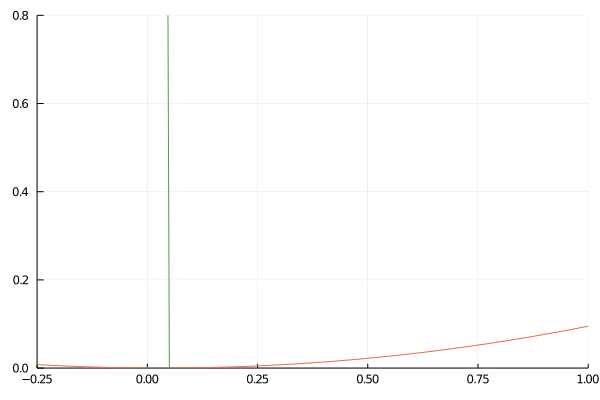

Julia sketches for exploring how Cornu spirals are used in reducing jerk in railway corners.

A [Cornu (or Euler) spiral](https://mathworld.wolfram.com/CornuSpiral.html) has a radius of curvature which decreases smoothly, as you can see in
this animation:

This is useful in interpolating between a straight section of track (with infinite radius of curvature)
and a circular section of track (with constant radius of curvature).
